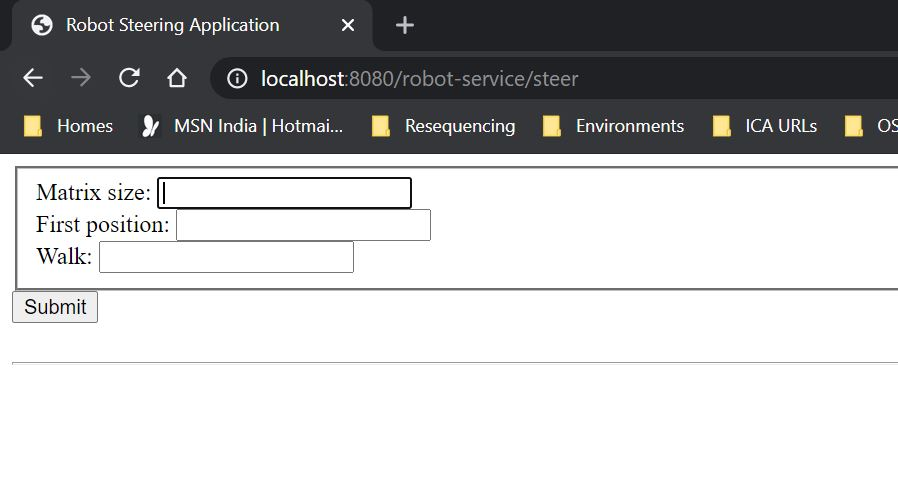
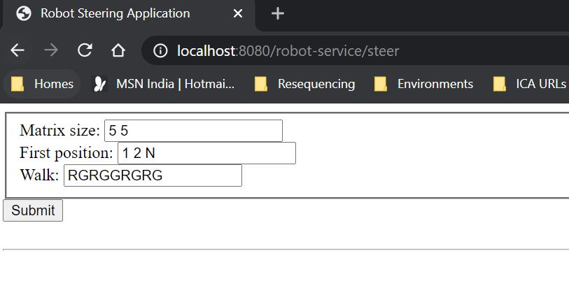
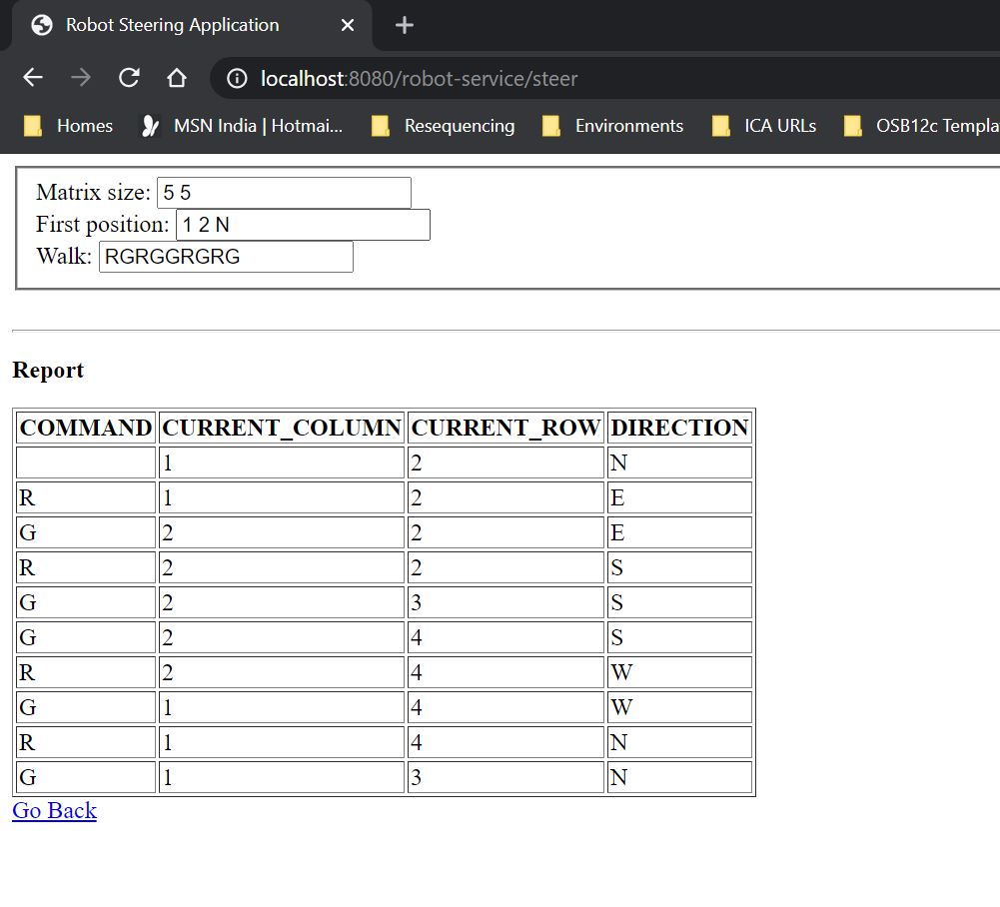
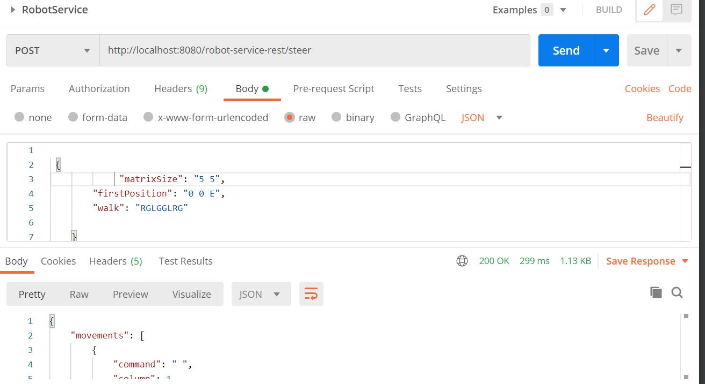

# RobotSteeringService

This service will help you move the robot in a room. You can specify the size of the room, starting position of the robot, and set of commands for the movement.

# Funcational Design

Matrix size: You need to specify the size of the room. Dimensions should be mentioned for a 2D matrix. Format should be 5 5. Which means 5 columns and 5 rows.
First position: This is to tell where the robot is staying right now. Format should be 0 0 E. First number is for the column, second for row, and last character is to specify direction the robot is facing. E W N or S.
Walk: Enter set of characters to move the robot accordingly. Format is RLGGLR
R will change direction to right.
L will change direction to left.
G will move robot one step forward.
# Technical Specs

This application is built using SpringBoot version 2.4.2
UI is built using Thymeleaf with HTML5 as template style.
google-java-format style. 
junit is used to build unit test cases.

# How to build the application

1. Clone the git repository

	git clone https://github.com/TejaKotra/RobotSteeringService.git

2. Import it in an IDE. It will download the dependencies automatically.

3. Since SpringBoot comes with embedded tomact server. We can run the application directly. Run RobotSteeringServiceApplication.
# How to run

1. Open a browser and enter http://localhost:8080/robot-service/steer

 

2. Enter the details and click on submit.

3. View report on Robot's movements.

4. You can also invoke rest endpoint to get report in Json format.

